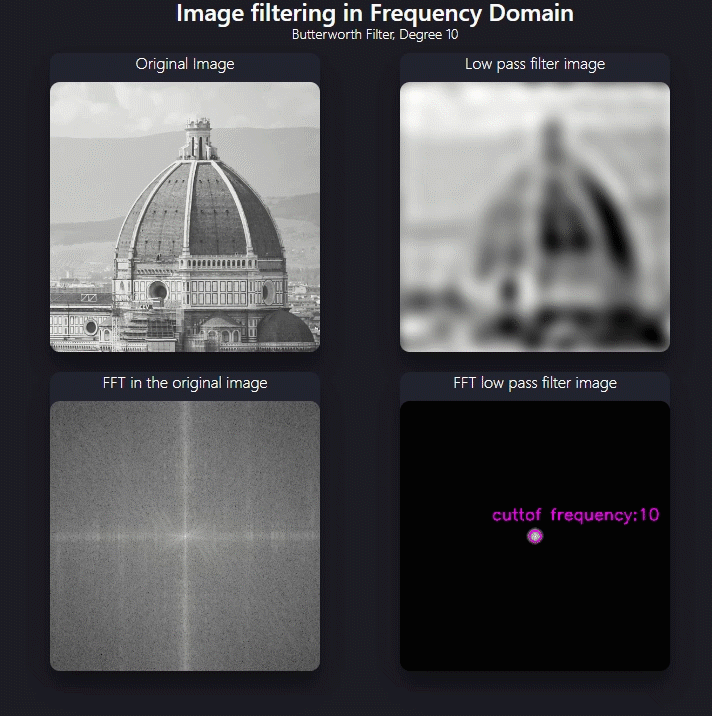

<h3 align="center">Image Frequency Filters</h3>


---

<p align="center"> This project provides a demonstration of how to use high and low pass filters for image filtering in frequency. The main idea of this project is to identify the differences of applying different filters and to understand how changing the frequency domain affects the spatial domain.
    <br> 
</p>



## 📝 Table of Contents
- [Getting Started](#getting_started)
- [Installing](#installing)
- [Usage](#usage)
- [Technology Stack](#tech_stack)
- [Contributing](../CONTRIBUTING.md)
- [Authors](#authors)
- [Acknowledgments](#acknowledgments)


## 🏁 Getting Started <a name = "getting_started"></a>

These instructions will provide you with a working copy of the project on your local machine. There are 2 examples of applying frequency filters showing the original image and the filtered image (The classic way). There is an additional example that shows frequency filtering in animated form (`in dashboard.py file`), this is great if you want to understand how different cutoff frequency values affect the filtered image.

### Installing <a name="installing"></a>

1. Clone the repository.
   git clone https://github.com/your_username/your_project.git

2. Install the required libraries.
   pip install -r requirements.txt

## 🎈 Usage <a name="usage"></a>

- Example 1

Apply low pass filter to image

1. Run the low_pass_example.py script

```
python -m examples.low_pass_example
```

- Example 2

Apply high pass filter to image

1. Run the high_pass_example.py script

```
python -m examples.high_pass_example
```

- Example 3

Check the filtering animation of multiple cuttof thresolds in a dynamic manner in Dash.

1. Run the dash.py script

```
python -m examples.dash
```

2. Open a web browser and navigate to http://localhost:8050/.

## ⛏️ Built With <a name = "tech_stack"></a>

- OpenCV
- NumPy
- Dash
- Matplotlib

## ✍️ Authors <a name = "authors"></a>

- [@alejomaar](https://github.com/alejomaar) - Idea & Initial work

## 🎉 Acknowledgments <a name = "acknowledgments"></a>

- References

- [Numpy](https://numpy.org/doc/stable/) - Numpy
- [Dash](https://dash.plotly.com/) - Dash
